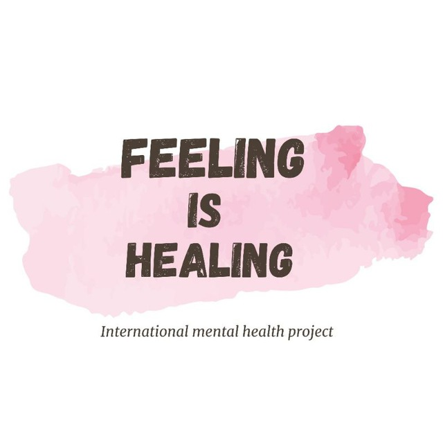

# feeling-is-healing-verification<!-- Feeling is Healing — Official Certificate Verification Portal -->
<!DOCTYPE html>
<html lang="en">
<head>
  <meta charset="UTF-8">
  <meta name="viewport" content="width=device-width, initial-scale=1.0">
  <title>Feeling is Healing | Official Certificate Verification Portal</title>

  <!-- Google Font -->
  <link rel="preconnect" href="https://fonts.googleapis.com">
  <link rel="preconnect" href="https://fonts.gstatic.com" crossorigin>
  <link href="https://fonts.googleapis.com/css2?family=Inter:wght@300;400;500;600;700;800&display=swap" rel="stylesheet">

  
</head>
<body>

  <!-- NAVIGATION -->
  <header class="navbar">
    

      <!-- Replace logo.png with your actual logo file -->
      
      

        <h1>Feeling is Healing</h1>
        
Research Initiative

      

    

    <nav>
      <a href="#verify">Verify</a>
      <a href="#about">About</a>
      <a href="#security">Security</a>
    </nav>
  </header>

  <!-- HERO -->
  <section class="hero">
    

      Official Certificate Authentication System
    

    <h2>Verify Participation in the Feeling is Healing Research Initiative</h2>

    

      Securely validate certificates issued through Feeling is Healing, an independent research project conducted with community outreach support from Econ for Teens.
    

    

      <a href="#verify" class="primary-btn">Verify Certificate</a>
      <a href="#about" class="secondary-btn">Learn More</a>
    

  </section>

  <!-- VERIFY -->
  <section class="verify-section" id="verify">
    

      <h3>Certificate Verification Portal</h3>
      

        Enter your Certificate ID below to confirm authenticity through our secure participant database.
      

      

        <input type="text" id="certificateCode" placeholder="Example: FIH-2026-001">
        <button onclick="verifyCertificate()">Verify Now</button>
      

      
Authenticating certificate...

      

    

  </section>

  <!-- ABOUT + SECURITY -->
  <section class="info-grid" id="about">
    

      <h4>About the Project</h4>
      

        Feeling is Healing is a youth-led research initiative exploring emotional reflection, AI interaction, and personal growth through structured participant studies.
      

    

    

      <h4>Security & Authenticity</h4>
      

        Every certificate includes a unique identifier connected to our verification database. Certificates can only be validated through this official portal.
      

    

    

      <h4>Collaboration</h4>
      

        Conducted by Feeling is Healing • Community outreach supported by Econ for Teens.
      

    

  </section>

  <!-- FOOTER -->
  <footer>
    © 2026 Feeling is Healing Research Initiative 
    Conducted independently by Feeling is Healing • Outreach support by Econ for Teens
  </footer>

  

</body>
</html>
